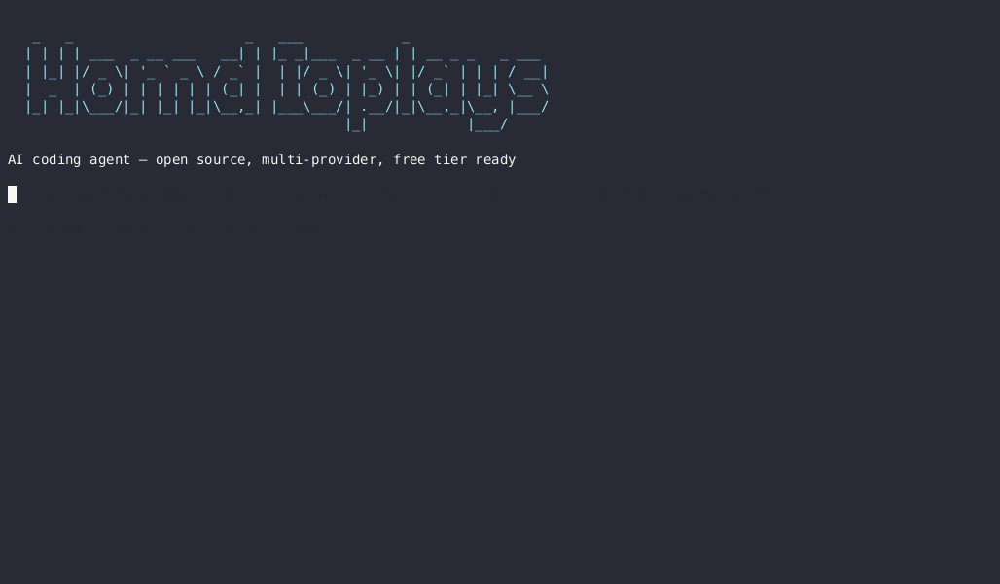

# 🤖 Install Hermes Agent + Free API Setup (Linux)



Tutorial lengkap install **Hermes Agent** di Linux (Ubuntu/Debian/Fedora/Arch) lengkap dengan **tips dapetin API key GRATIS** dari Groq, NVIDIA, Cloudflare, dan 10+ provider lain. 100% no credit card.

> Bahasa: 🇮🇩 Indonesia (mixed with English technical terms)
> Tested on: Ubuntu 24.04, Debian 12, Fedora 41, Arch (2026-06-20)

---

## ⚡ Quick Start (TL;DR)

```bash
# 1. Install Hermes Agent (satu baris)
curl -fsSL https://raw.githubusercontent.com/NousResearch/hermes-agent/main/scripts/install.sh | bash

# 2. Verifikasi
hermes doctor

# 3. Setup provider + API key
hermes setup
# Pilih provider: groq / nvidia / openrouter / cloudflare / dll
# Paste API key → done

# 4. Test chat
hermes chat -q "Halo, apa kabar?"
```

**Belum punya API key?** Lanjut ke [📋 Daftar Free API](#-daftar-free-api-gratis) di bawah.

---

## 📑 Daftar Isi

1. [Apa itu Hermes Agent?](#-apa-itu-hermes-agent)
2. [Prasyarat](#-prasyarat)
3. [Install Step-by-Step (Linux)](#-install-step-by-step-linux)
   - [Ubuntu / Debian / Pop!\_OS / Linux Mint](#ubuntu--debian--pop_os--linux-mint)
   - [Fedora / RHEL / Rocky Linux](#fedora--rhel--rocky-linux)
   - [Arch / Manjaro / EndeavourOS](#arch--manjaro--endeavouros)
4. [Setup Provider + API Key](#-setup-provider--api-key)
5. [📋 Daftar Free API GRATIS](#-daftar-free-api-gratis)
6. [Tips Optimasi & Hemat Quota](#-tips-optimasi--hemat-quota)
7. [Troubleshooting](#-troubleshooting)
8. [Verifikasi Instalasi](#-verifikasi-instalasi)
9. [Upgrade / Uninstall](#-upgrade--uninstall)

---

## 🤔 Apa itu Hermes Agent?

**Hermes Agent** = AI agent framework open-source dari [Nous Research](https://nousresearch.com) yang jalan di terminal lo. Bisa:

- 🖥️ **CLI** — interaktif kayak Claude Code / Codex
- 💬 **Telegram/Discord bot** — pakai gateway
- 🐍 **Coding assistant** — multi-provider (Groq, NVIDIA, Anthropic, OpenAI, dll)
- 🧠 **Punya memory** — inget preferensi lo antar session
- 🛠️ **Skills & plugins** — extend kemampuannya

**Bedanya sama Claude Code / Codex?**
- 100% open-source
- Gonta-ganti model/provider tanpa ribet
- 20+ LLM provider didukung
- Jalan di Linux, macOS, WSL, Windows

**Repo resmi:** https://github.com/NousResearch/hermes-agent
**Dokumentasi:** https://hermes-agent.nousresearch.com/docs/

---

## 📦 Prasyarat

| Komponen | Minimum | Rekomendasi |
|----------|---------|-------------|
| OS | Linux x86_64 (kernel 5.10+) | Ubuntu 24.04 LTS |
| RAM | 2 GB | 4 GB+ |
| Disk | 5 GB | 10 GB |
| Python | 3.10+ | 3.11 atau 3.12 |
| Network | 10 Mbps | Stabil |

Cek versi Python lo:
```bash
python3 --version    # harus ≥ 3.10
```

---

## 🐧 Install Step-by-Step (Linux)

### Ubuntu / Debian / Pop!_OS / Linux Mint

```bash
# Step 1: Update repo + install dependency
sudo apt update && sudo apt install -y curl git python3 python3-venv python3-pip build-essential

# Step 2: Install Hermes Agent (satu baris)
curl -fsSL https://raw.githubusercontent.com/NousResearch/hermes-agent/main/scripts/install.sh | bash

# Step 3: Tambah ke PATH (jika belum otomatis)
echo 'export PATH="$HOME/.local/bin:$PATH"' >> ~/.bashrc
source ~/.bashrc

# Step 4: Verifikasi
hermes --version
hermes doctor
```

**Verifikasi sukses kalau output `hermes doctor`:**
```
✓ Python 3.11.x detected
✓ pip available
✓ config dir writable
✓ All required dependencies installed
```

### Fedora / RHEL / Rocky Linux

```bash
# Step 1: Install dependency
sudo dnf install -y curl git python3 python3-pip python3-devel gcc make

# Step 2: Install Hermes Agent
curl -fsSL https://raw.githubusercontent.com/NousResearch/hermes-agent/main/scripts/install.sh | bash

# Step 3: PATH
echo 'export PATH="$HOME/.local/bin:$PATH"' >> ~/.bashrc
source ~/.bashrc

# Step 4: Verifikasi
hermes doctor
```

### Arch / Manjaro / EndeavourOS

```bash
# Step 1: Install dependency
sudo pacman -S --needed curl git python python-pip base-devel

# Step 2: Install Hermes Agent
curl -fsSL https://raw.githubusercontent.com/NousResearch/hermes-agent/main/scripts/install.sh | bash

# Step 3: PATH
echo 'export PATH="$HOME/.local/bin:$PATH"' >> ~/.bashrc
source ~/.bashrc

# Step 4: Verifikasi
hermes doctor
```

> **Catatan WSL (Windows):** Semua command di atas jalan di WSL2 tanpa modifikasi. Pastikan `systemd=true` di `/etc/wsl.conf` agar service/gateway bisa auto-start.

---

## 🔑 Setup Provider + API Key

Setelah install, setup model + API key:

```bash
# Cara 1: Wizard interaktif (recommended untuk pemula)
hermes setup

# Cara 2: Set manual via CLI
hermes model
# Pilih: groq / nvidia / openrouter / cloudflare / anthropic / openai

# Cara 3: Set di config langsung
hermes config set model.default "groq/llama-3.3-70b-versatile"
hermes config set model.provider groq
# Lalu taruh API key di ~/.hermes/.env:
echo "GROQ_API_KEY=gsk_xxxxxxxxx" >> ~/.hermes/.env
```

**Test koneksi:**
```bash
hermes chat -q "Test koneksi, balas pakai bahasa Indonesia ya"
```

---

## 📋 Daftar Free API GRATIS

Semua provider di bawah ini **GRATIS** (ada yang unlimited, ada yang quota harian/bulanan). Link signup langsung.

### 🏆 Top Picks (Gratis, Stabil, No Credit Card)

| # | Provider | Kategori | Free Tier | Link Signup | Catatan |
|---|----------|----------|-----------|-------------|---------|
| 1 | **Groq** | LLM Inference | **Unlimited** (rate-limited ~500K tokens/hari) | https://console.groq.com | ⭐ PALING CEPAT. Pakai LPU custom. Cocok untuk daily driver |
| 2 | **NVIDIA NIM** | LLM Inference | **1000 requests/bulan** per model | https://build.nvidia.com | Nemotron, Llama, Mistral, DeepSeek |
| 3 | **Cloudflare Workers AI** | LLM Inference | **10,000 requests/hari** | https://dash.cloudflare.com | Llama, Mistral, Qwen, IBM Granite |
| 4 | **OpenRouter** | LLM Gateway | **$1 signup + 50 req/hari free** | https://openrouter.ai | Akses 100+ model dari 1 key |
| 5 | **Google AI Studio** | LLM (Gemini) | **2 req/detik, 50 req/hari** (free tier) | https://aistudio.google.com | Gemini 2.0 Flash, 2.5 Pro |
| 6 | **Hugging Face** | LLM + Embedding | **$0.10/hari inference credit** | https://huggingface.co/settings/tokens | Ribuan model open-source |
| 7 | **GitHub Models** | LLM | **Free untuk user Copilot** | https://github.com/marketplace/models | GPT-4o, Llama, Phi, Mistral |
| 8 | **Cerebras** | LLM Inference | **1M tokens/hari** | https://inference.cerebras.ai | Llama 3.3 70B super cepat |
| 9 | **Mistral AI** | LLM | **Rate-limited free tier** | https://console.mistral.ai | Mistral 7B, Mixtral, Large |
| 10 | **Cohere** | LLM | **1000 req/bulan free** | https://dashboard.cohere.ai | Command R+ bagus untuk RAG |

### 🎯 Specialized (Voice / Image / Search / Embedding)

| # | Provider | Kategori | Free Tier | Link | Catatan |
|---|----------|----------|-----------|------|---------|
| 11 | **Deepgram** | STT/TTS | **$200 signup credit** | https://deepgram.com | Voice agent terbaik |
| 12 | **ElevenLabs** | TTS | **10K chars/bulan free** | https://elevenlabs.io | Voice cloning |
| 13 | **Edge TTS** | TTS | **Unlimited** (built-in) | pakai `edge-tts` Python lib | Default TTS Hermes |
| 14 | **AssemblyAI** | STT | **$10 signup** | https://assemblyai.com | Transkrip audio/video |
| 15 | **Leonardo AI** | Image | **150 tokens/hari** | https://leonardo.ai | Image gen |
| 16 | **Ideogram** | Image | **Free tier harian** | https://ideogram.ai | Image + typography |
| 17 | **Tavily** | AI Search | **1K credits/bulan** | https://tavily.com | Web search untuk agent |
| 18 | **Firecrawl** | Scraping | **500 pages/bulan** | https://firecrawl.dev | Crawl web untuk RAG |
| 19 | **Voyage AI** | Embedding | **50M tokens** | https://voyageai.com | Embedding untuk RAG |
| 20 | **Jina AI** | Embedding | **1M tokens** | https://jina.ai | Multimodal embedding |

### 🥇 Ranking (Pilih Salah Satu untuk Daily Driver)

| Rank | Provider | Alasan |
|------|----------|--------|
| 🥇 | **Groq** | Unlimited tier, paling cepat di dunia, model Llama 3.3 70B |
| 🥈 | **NVIDIA NIM** | Kualitas tinggi (Nemotron Super 120B), 1000 req/bulan cukup |
| 🥉 | **Cloudflare Workers AI** | 10K req/hari, multi-model, no rate limit ketat |
| 4 | **OpenRouter** | 1 key untuk 100+ model, fallback antar provider |
| 5 | **Cerebras** | 1M tokens/hari, inference super cepat |

---

## 🎯 Step-by-Step: Groq (Recommended #1)

Groq = **paling cepat dan unlimited** untuk daily driver. Setup 2 menit:

### 1. Signup
- Buka https://console.groq.com
- Klik "Sign Up" → login pakai Google/GitHub
- Verifikasi email

### 2. Bikin API Key
- Pergi ke https://console.groq.com/keys
- Klik "Create API Key"
- Nama: bebas (misal "hermes-laptop")
- **COPY key-nya** (format: `gsk_xxxxxxxxxxxxxxxxxxxx`)
- ⚠️ **Key cuma muncul SEKALI** — simpan di password manager

### 3. Taruh di Hermes
```bash
# Cara A: lewat wizard
hermes setup
# → pilih "groq"
# → paste API key

# Cara B: manual
mkdir -p ~/.hermes
echo "GROQ_API_KEY=gsk_xxxxxxxxxxxxxxxxxxxx" >> ~/.hermes/.env
hermes config set model.default "groq/llama-3.3-70b-versatile"
hermes config set model.provider groq
```

### 4. Test
```bash
hermes chat -q "Halo, siapa kamu?"
```

**Model Groq yang tersedia (cek update di https://console.groq.com/docs/models):**
| Model | Context | Speed | Best For |
|-------|---------|-------|----------|
| `llama-3.3-70b-versatile` | 131K | ⚡⚡⚡ | General purpose, paling pintar |
| `llama-3.1-8b-instant` | 131K | ⚡⚡⚡⚡⚡ | Fast responses, lebih murah |
| `meta-llama/llama-4-maverick-17b-128e-instruct` | 131K | ⚡⚡⚡ | Latest Llama 4 |
| `mixtral-8x7b-32768` | 32K | ⚡⚡⚡ | Coding, multilingual |
| `whisper-large-v3-turbo` | audio | ⚡⚡ | STT gratis |

---

## 🎯 Step-by-Step: NVIDIA NIM (Recommended #2)

NVIDIA NIM = kualitas tinggi (Nemotron 120B), cocok untuk task berat.

### 1. Signup
- Buka https://build.nvidia.com
- Klik "Get Started" atau "Sign In"
- Login pakai Google/email + verifikasi

### 2. Bikin API Key
- Pergi ke https://build.nvidia.com (setelah login)
- Klik profil → "API Keys" → "Generate Key"
- Nama: bebas
- **COPY key** (format: `nvapi-xxxxxxxxxxxx`)

### 3. Taruh di Hermes
```bash
# NVIDIA pakai custom base_url
hermes config set model.default "nvidia/nemotron-3-super-120b-a12b"
hermes config set model.provider nvidia
hermes config set model.base_url "https://integrate.api.nvidia.com/v1"
echo "NVIDIA_API_KEY=nvapi-xxxxxxxxxxxx" >> ~/.hermes/.env
```

### 4. Test
```bash
hermes chat -q "Explain quantum computing in simple terms"
```

**Model NVIDIA yang recommended:**
| Model | Use Case |
|-------|----------|
| `nvidia/nemotron-3-super-120b-a12b` | Reasoning, coding, agent |
| `meta/llama-3.1-70b-instruct` | General purpose |
| `mistralai/mistral-large-2-instruct` | Multilingual, RAG |
| `deepseek-ai/deepseek-r1` | Deep reasoning |

> ⚠️ **Catatan NVIDIA 2026-06**: Endpoint API sudah diupdate ke `https://integrate.api.nvidia.com/v1`. Yang lama sudah deprecated. Kalau masih pakai yang lama akan error.

---

## 🎯 Step-by-Step: Cloudflare Workers AI (Recommended #3)

Cocok untuk **high-volume** karena 10K req/hari.

### 1. Signup
- Buka https://dash.cloudflare.com/sign-up
- Bikin akun (free tier, no credit card)

### 2. Dapatkan Account ID
- Dashboard → sidebar kanan bawah → "Account ID" → copy

### 3. Bikin API Token
- https://dash.cloudflare.com/profile/api-tokens
- "Create Token" → template "Edit Cloudflare Workers"
- Set permissions: `Workers Scripts:Edit`, `Workers KV Storage:Edit`, `Account Settings:Read`
- **COPY token**

### 4. Taruh di Hermes
```bash
hermes config set model.default "@cf/meta/llama-3.3-70b-instruct-fp8-fast"
hermes config set model.provider cloudflare
hermes config set model.base_url "https://api.cloudflare.com/client/v4/accounts/<ACCOUNT_ID>/ai/v1"
echo "CLOUDFLARE_API_TOKEN=xxxxxxxx" >> ~/.hermes/.env
echo "CLOUDFLARE_ACCOUNT_ID=xxxxxxxx" >> ~/.hermes/.env
```

---

## 💡 Tips Optimasi & Hemat Quota

### 1. Pakai Model Kecil untuk Task Sederhana
```bash
# Default: pakai model besar (cerdas tapi boros)
hermes config set model.default "groq/llama-3.3-70b-versatile"

# Hemat: pakai model kecil (lebih cepat, gratis unlimited)
hermes config set model.default "groq/llama-3.1-8b-instant"
```

### 2. Multi-Provider Fallback
Kalau satu provider down/quota habis, otomatis pindah:
```bash
# Edit ~/.hermes/config.yaml
model:
  default: "groq/llama-3.3-70b-versatile"
  fallbacks:
    - "nvidia/nemotron-3-super-120b-a12b"
    - "@cf/meta/llama-3.3-70b-instruct-fp8-fast"
    - "openrouter/meta-llama/llama-3.3-70b-instruct:free"
```

### 3. Compress Context
```bash
hermes config set compression.enabled true
hermes config set compression.threshold 0.5  # compress saat context 50% penuh
```

### 4. Pakai Local Whisper (STT Gratis Unlimited)
```bash
pip install faster-whisper
hermes config set stt.provider local
hermes config set stt.local.model base    # tiny/base/small/medium
```

### 5. Cache API Key di Environment
Taruh di `~/.bashrc` supaya persistent:
```bash
echo 'export GROQ_API_KEY="gsk_xxxxxxxxxxxx"' >> ~/.bashrc
source ~/.bashrc
```

### 6. Monitor Quota
```bash
hermes insights --days 7    # lihat usage 7 hari terakhir
```

---

## 🛠️ Troubleshooting

### ❌ `command not found: hermes`
**Fix:** PATH belum di-set.
```bash
echo 'export PATH="$HOME/.local/bin:$PATH"' >> ~/.bashrc
source ~/.bashrc
which hermes    # harus muncul path
```

### ❌ `ModuleNotFoundError: No module named 'hermes_agent'`
**Fix:** Python version conflict. Hermes butuh Python ≥3.10.
```bash
python3 --version    # cek dulu
ls ~/.local/lib/     # cari folder python3.X
# Jika Python salah, install manual:
python3 -m pip install --user hermes-agent
```

### ❌ `Permission denied: /usr/local/bin/hermes`
**Fix:** Jangan install global. Pakai user install:
```bash
python3 -m pip install --user hermes-agent
export PATH="$HOME/.local/bin:$PATH"
```

### ❌ `API key invalid` atau `401 Unauthorized`
**Fix:**
1. Cek key format — Groq: `gsk_*`, NVIDIA: `nvapi-*`, OpenRouter: `sk-or-*`
2. Pastikan key ada di `~/.hermes/.env` (BUKAN `config.yaml`)
3. Restart Hermes: `hermes logout && hermes setup`

### ❌ NVIDIA API error 404
**Fix:** Endpoint berubah. Pakai yang baru:
```bash
hermes config set model.base_url "https://integrate.api.nvidia.com/v1"
```

### ❌ Gateway nggak connect ke Telegram/Discord
**Fix:**
```bash
hermes gateway setup
# Ikuti wizard, paste bot token

# Cek log kalau error
tail -50 ~/.hermes/logs/gateway.log
```

### ❌ `externally-managed-environment` (PEP 668)
**Fix:** Pakai venv:
```bash
python3 -m venv ~/.hermes/venv
source ~/.hermes/venv/bin/activate
pip install hermes-agent
```

### ❌ Config error UTF-8 BOM
**Fix:** File `config.yaml` ke-save dengan BOM. Re-save as UTF-8 tanpa BOM:
```bash
hermes config edit    # otomatis save tanpa BOM
```

---

## ✅ Verifikasi Instalasi

Jalanin script ini buat cek semuanya OK:

```bash
curl -fsSL https://raw.githubusercontent.com/Celebez/hermes-agent-install-free-api/main/scripts/verify-install.sh | bash
```

Atau manual:

```bash
echo "=== Python ==="
python3 --version

echo "=== Hermes ==="
hermes --version
hermes doctor

echo "=== Config ==="
ls -la ~/.hermes/
cat ~/.hermes/.env | grep -v "^#" | sed 's/=.*/=***/'

echo "=== Test chat ==="
hermes chat -q "Balas dengan: INSTALL OK"
```

Kalau semua ✅, lo siap pakai Hermes Agent!

---

## 🔄 Upgrade / Uninstall

### Upgrade
```bash
hermes update
```

### Uninstall
```bash
hermes uninstall
rm -rf ~/.hermes
```

---

## 📚 Resource Tambahan

- 📖 Docs resmi: https://hermes-agent.nousresearch.com/docs/
- 💬 Discord Nous: https://discord.gg/NousResearch
- 🐙 GitHub: https://github.com/NousResearch/hermes-agent
- 📋 Skills catalog: https://hermes-agent.nousresearch.com/docs/reference/skills-catalog

---

## 📜 Lisensi

MIT — bebas pake, modif, distribusikan.

## ⭐ Credits

Dibikin oleh [Celebez](https://github.com/Celebez) untuk komunitas Hermes Agent Indonesia.
